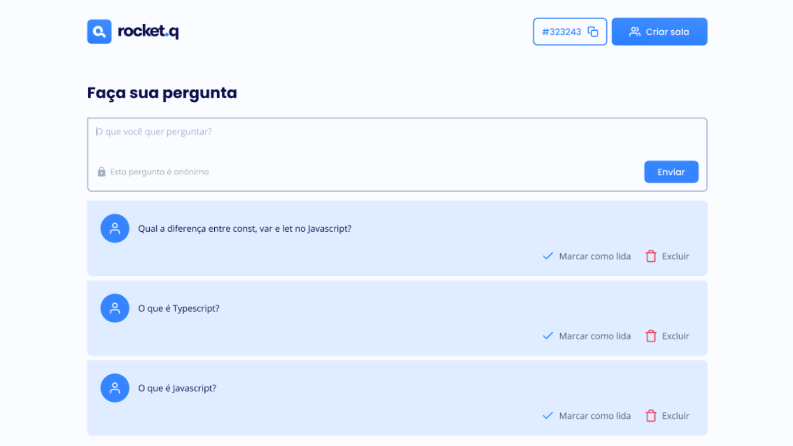

Nesse projeto foram utilizadas as seguinte tecnologias:
 
<ul>
<li>HTML</li>
<li>CSS</li>
<li>NodeJS</li>
<li>SQL</li>
<li>JavaScript</li>
<li>Git e Github</li>
</ul>

CONFIRA O PROJETO <a href="https://marsinhor.github.io/pagina-de-links" target="_blank">AQUI</a>

# Plataforma-De-Perguntas